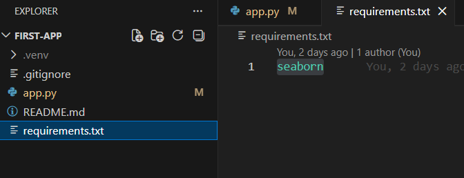

# MODULE: PYTHON STREAMLIT DASHBOARD - CHINOOK

Time: 1-2 hours

## Business Requirements

The executive team wants an interactive dashboard to explore the Chinook digital music store data. Your task is to:

1. Connect to the Chinook database on Supabase and load data
2. Display key business metrics at a glance
3. Create visualizations showing:
   - Top 10 artists by revenue
   - Monthly revenue trend
   - Revenue by country
4. Add sidebar filters for country and date range

Build this as a Streamlit web app they can access through their browser.

---

## Detailed Task Breakdown

### Part 1: Setup Environment

**Step 1: Install Required Packages**

Install streamlit, pandas, seaborn, matplotlib, sqlalchemy, and psycopg2-binary.

**Step 2: Create Project Structure**

Create a folder with `app.py`. Have your Supabase connection credentials ready.

---

### Part 2: Build the Dashboard

**Step 3: Import Libraries and Connect to Database**

Set up imports and define your Supabase credentials (USER, PASSWORD, HOST, PORT, DBNAME) to construct the SQLAlchemy connection string.

**Step 4: Load Data**

Write a `@st.cache_data` function that queries two things:
- All invoices (invoice_id, customer_id, invoice_date, billing_country, total)
- Invoice line detail joined to artist (invoice_id, artist name, line total). This is kept raw so artist revenue can be recomputed after filters are applied

**Step 5: Add Sidebar Filters**

Add a country dropdown (selectbox with "All Countries" as default) and a date range picker. Apply both filters to the invoices dataframe.

**Step 6: Compute Filtered Artist Revenue**

After filtering, derive the top 10 artists by revenue by filtering invoice_line_detail to only the filtered invoice IDs, then grouping by artist.

**Step 7: Display Key Metrics**

Three metric cards: Total Revenue, Total Invoices, Total Customers.

**Step 8: Top 10 Artists by Revenue**

Horizontal bar chart using `sns.catplot` with data labels on each bar.

**Step 9: Monthly Revenue Trend**

Add a month column using `strftime('%Y-%m')`, group by month, plot using `sns.relplot`.

**Step 10: Revenue by Country**

Horizontal bar chart using `sns.catplot` sorted descending with data labels on each bar.

**Step 11: Raw Data Table**

Display the filtered invoices dataframe at the bottom.

---

## Deliverable

Save your work as **app.py**

Your application should include:
- Supabase connection via SQLAlchemy
- Cached data load with `@st.cache_data`
- Sidebar filters (country dropdown + date range)
- Three metric cards
- Three charts (catplot bar, relplot line, catplot bar)
- Raw data table
- `requirements.txt` with seaborn listed

---

## Need Help?

### Part 1: Setup Environment

**Step 1: Install Required Packages**

```bash
pip install streamlit pandas seaborn matplotlib sqlalchemy psycopg2-binary
```

### Part 2: Build the Dashboard

**Complete code for app.py:**

```python
import streamlit as st
import pandas as pd
import seaborn as sns
import matplotlib.pyplot as plt
from sqlalchemy import create_engine, text

st.set_page_config(page_title="Chinook Music Dashboard", layout="wide")
st.title("Chinook Music Store Dashboard")

USER = "readonly_user.tyxjmbptftftcqgozyfc"
PASSWORD = "your_secure_password"
HOST = "aws-1-us-east-1.pooler.supabase.com"
PORT = "6543"
DBNAME = "postgres"

DB_URL = f"postgresql+psycopg2://{USER}:{PASSWORD}@{HOST}:{PORT}/{DBNAME}?sslmode=require"

@st.cache_data
def load_data():
    engine = create_engine(DB_URL)
    with engine.connect() as conn:
        invoices = pd.read_sql(text("""
            SELECT i.invoice_id, i.customer_id, i.invoice_date,
                   i.billing_country, i.total
            FROM invoice i
        """), conn)

        # Load invoice line detail joined to artist for filtered revenue chart
        invoice_line_detail = pd.read_sql(text("""
            SELECT il.invoice_id,
                   ar.name AS artist,
                   il.unit_price * il.quantity AS line_total
            FROM invoice_line il
            JOIN track t ON il.track_id = t.track_id
            JOIN album al ON t.album_id = al.album_id
            JOIN artist ar ON al.artist_id = ar.artist_id
        """), conn)

    invoices['invoice_date'] = pd.to_datetime(invoices['invoice_date'])
    return invoices, invoice_line_detail

invoices, invoice_line_detail = load_data()

#Sidebar Filters
st.sidebar.header("Filters")

country_options = ["All Countries"] + sorted(invoices['billing_country'].unique())
selected_country = st.sidebar.selectbox("Country", options=country_options)

data_min_date = invoices['invoice_date'].min().date()
data_max_date = invoices['invoice_date'].max().date()
date_range = st.sidebar.date_input(
    "Date Range",
    value=(data_min_date, data_max_date)
)

# Guard: date_input returns a 1-tuple while user is still picking the end date
if len(date_range) != 2:
    st.info("Please select an end date to continue.")
    st.stop()

country_mask = True if selected_country == "All Countries" else invoices['billing_country'] == selected_country
invoices = invoices[
    country_mask &
    (invoices['invoice_date'].dt.date >= date_range[0]) &
    (invoices['invoice_date'].dt.date <= date_range[1])
]

# Artist revenue computed from filtered invoice IDs only
filtered_invoice_ids = invoices['invoice_id'].tolist()
artist_revenue = (
    invoice_line_detail[invoice_line_detail['invoice_id'].isin(filtered_invoice_ids)]
    .groupby('artist')['line_total']
    .sum()
    .round(2)
    .sort_values(ascending=False)
    .head(10)
    .reset_index()
    .rename(columns={'line_total': 'revenue'})
)

#Key Metrics
st.header("Key Metrics")

col1, col2, col3 = st.columns(3)

with col1:
    st.metric("Total Revenue", f"${invoices['total'].sum():,.2f}")

with col2:
    st.metric("Total Invoices", f"{len(invoices):,}")

with col3:
    st.metric("Total Customers", f"{invoices['customer_id'].nunique():,}")

st.divider()

#Top 10 Artists by Revenue
st.header("Top 10 Artists by Revenue")

fig1 = sns.catplot(x='revenue', y='artist', data=artist_revenue, kind='bar', height=6, aspect=1.6)
fig1.set_axis_labels('Revenue ($)', 'Artist')
fig1.ax.set_title('Top 10 Artists by Revenue')
for bar in fig1.ax.patches:
    fig1.ax.text(bar.get_width(), bar.get_y() + bar.get_height() / 2,
                 f"${bar.get_width():,.2f}", va='center', ha='left', fontsize=9)
st.pyplot(fig1)

st.divider()

#Monthly Revenue Trend
st.header("Monthly Revenue Trend")

invoices['month'] = invoices['invoice_date'].dt.strftime('%Y-%m')
monthly = invoices.groupby('month')['total'].sum().reset_index()

fig2 = sns.relplot(x='month', y='total', data=monthly, kind='line', marker='o', height=5, aspect=2)
fig2.set_axis_labels('Month', 'Revenue ($)')
fig2.ax.set_title('Monthly Revenue Trend')
fig2.ax.grid(True, alpha=0.3)
plt.xticks(rotation=45)
st.pyplot(fig2)

st.divider()

#Revenue by Country
st.header("Revenue by Country")

country_rev = (
    invoices.groupby('billing_country')['total']
    .sum()
    .sort_values(ascending=False)
    .reset_index()
    .rename(columns={'billing_country': 'country', 'total': 'revenue'})
)

fig3 = sns.catplot(x='revenue', y='country', data=country_rev, kind='bar', height=8, aspect=1.2)
fig3.set_axis_labels('Revenue ($)', 'Country')
fig3.ax.set_title('Revenue by Country')
for bar in fig3.ax.patches:
    fig3.ax.text(bar.get_width(), bar.get_y() + bar.get_height() / 2,
                 f"${bar.get_width():,.2f}", va='center', ha='left', fontsize=9)
st.pyplot(fig3)

st.divider()

#Raw Data Table
st.header("Raw Invoice Data")
st.dataframe(invoices, use_container_width=True)
```

### Part 3: Run Locally and Deploy

**Step 12: Run Locally**

In your terminal, navigate to your project folder and run:

```bash
streamlit run app.py
```

Your browser should automatically open to http://localhost:8501

**Step 13: Create requirements.txt**

Before deploying, create a `requirements.txt` file in your project folder. Streamlit Cloud needs this to install dependencies. Make sure seaborn is explicitly listed or it will not be installed:

```
seaborn
```



**Step 14: Deploy to Streamlit Cloud**

1. Push your project to a GitHub repository
2. Go to [share.streamlit.io](https://share.streamlit.io) and sign in
3. Click "New app", select your repo and set the main file path to `app.py`
4. Click Deploy

---

## Chinook Table Reference

| Table | Key Columns Used |
|---|---|
| `invoice` | `invoice_id`, `customer_id`, `invoice_date`, `billing_country`, `total` |
| `invoice_line` | `invoice_id`, `track_id`, `unit_price`, `quantity` |
| `track` | `track_id`, `album_id` |
| `album` | `album_id`, `artist_id` |
| `artist` | `artist_id`, `name` |

> All table and column names are PostgreSQL snake_case. Do not use PascalCase (e.g. `InvoiceId`) - it will throw an undefined column error.
